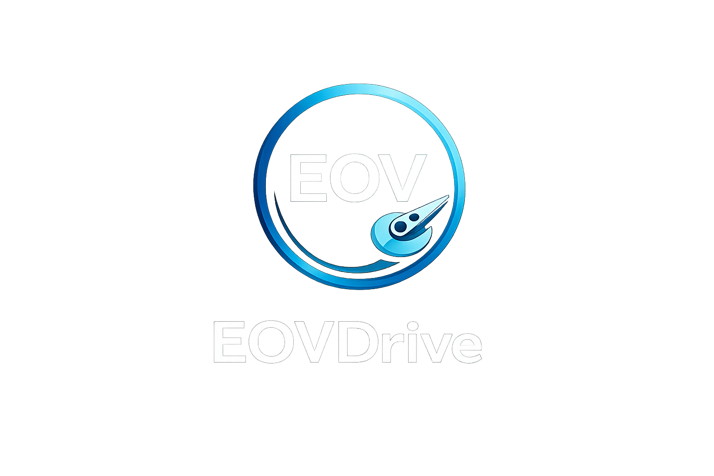

  

# EOVDrive

**C++ compressed virtual volume/archive engine with smart codec selection, verification, CLI tools, and experimental Windows mount support.**

EOVDrive is a pre-revenue technical asset built around a compressed and verifiable virtual volume format called `.eov`.

## Vision

The vision is to make storage smarter: instead of storing every file in one fixed way, EOVDrive breaks data into chunks, evaluates available compression strategies, stores the best verified representation, and allows data to be read back reliably from the compressed volume.

The long-term goal is a Windows-focused compressed virtual drive where files can be stored efficiently and accessed through a normal filesystem-style interface.

## What Works Today

- C++ core engine builds
- CLI can create `.eov` volumes
- Import/export/list/stats/verify/read-range flows work
- Byte-range reads can access data from the compressed volume without exporting the whole file first
- Chunk/manifest/index-based volume structure
- Multiple codec implementations
- Local validation and smoke tests included in the private sale package

## Included in the Sale

- Full C++ source code
- CMake build system
- CLI tool
- Codec implementations
- Validation scripts and tests
- Documentation
- Sample `.eov` volumes
- Windows service, installer, ProjFS/native driver prototype code
- Buyer handoff documents

## Current Status

This is not being sold as a finished consumer product.

The strongest part is the read-only compressed volume/archive engine and CLI. The native Windows driver/mount layer is experimental and not production-ready. Write support is not production-ready.

## Best Buyer

A C++/Windows/storage/compression developer or small team interested in compression, archive formats, virtual filesystems, or developer utilities.

## Buyer Materials

- [Sale Summary](docs/SALE_SUMMARY.md)
- [Test Results](docs/TEST_RESULTS.md)
- [Buyer Due Diligence](docs/BUYER_DUE_DILIGENCE.md)
- [Transfer Checklist](docs/TRANSFER_CHECKLIST.md)
- [SideProjectors Listing Text](docs/SIDEPROJECTORS_LISTING.md)

## Asking Price

**$750 OBO.** Fast-close offers around **$500-$600** may be considered.

## Important Note

This public repository is only an overview page. The full source code is not included here and is transferred privately after payment or escrow.
